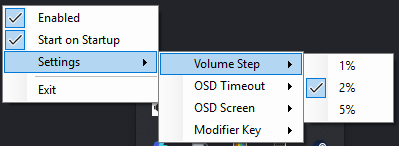
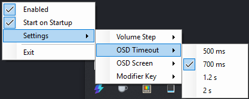
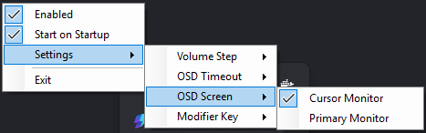
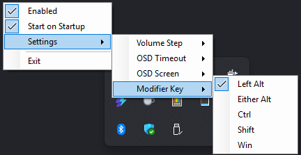

# WheelVolume

A tiny Windows tray app that lets you control system volume with your mouse wheel.

Hold Left Alt + scroll to change volume.
Hold Left Alt + middle-click to mute.

No telemetry. Portable build available.

## Features
- Adjust system volume with a modifier key and the mouse wheel
- Toggle mute with the modifier key and middle mouse button
- On-screen volume indicator (OSD)
- Optional start with Windows
- Settings stored locally for the current Windows user

## Downloads
- [WheelVolume-v1.0.0-portable-win-x64.zip](https://github.com/JolleNo10/WheelVolume/releases/download/v1.0.0/WheelVolume-v1.0.0-portable-win-x64.zip): Portable build. No installation and no separate .NET install required.
- [WheelVolume-v1.0.0-win-x64.zip](https://github.com/JolleNo10/WheelVolume/releases/download/v1.0.0/WheelVolume-v1.0.0-win-x64.zip): Smaller build, but requires the .NET 8 Windows Desktop Runtime.

## Usage
- Hold the configured modifier key and scroll the mouse wheel to change volume.
- Hold the configured modifier key and click the middle mouse button to toggle mute.
- Right-click the tray icon to change settings or exit.

The default modifier key is Left Alt.

If you enable `Start with Windows` from a portable build, extract WheelVolume to its final folder first. Windows stores the exact executable path.

Settings are saved locally for the current Windows user in:

```text
%LOCALAPPDATA%\WheelVolume\settings.json
```

## Screenshots










## Requirements
- Windows 10 / 11
- Portable release: no .NET install required
- Normal release: .NET 8 Windows Desktop Runtime

## Security / SmartScreen

WheelVolume is currently unsigned, so Windows SmartScreen may show an "Unknown publisher" warning.

The app:
- is open source
- has no telemetry
- does not require admin rights
- stores settings locally
- can be built from source

For extra verification, you can scan the release on VirusTotal or build it yourself.

## Build
From the project root, run:

```powershell
dotnet build -c Release
```

Building from source requires the .NET 8 SDK.

## Test

```powershell
dotnet run --project .\WheelVolume.Tests\WheelVolume.Tests.csproj -c Release
```

## Publish

Portable release, with the .NET runtime included:

```powershell
dotnet publish .\WheelVolume\WheelVolume.csproj -c Release -r win-x64 --self-contained true -p:PublishSingleFile=true -p:DebugType=None -p:DebugSymbols=false -o .\release\WheelVolume-portable-win-x64
```

Normal release, requiring the .NET 8 Windows Desktop Runtime:

```powershell
dotnet publish .\WheelVolume\WheelVolume.csproj -c Release -r win-x64 --self-contained false -p:PublishSingleFile=true -p:DebugType=None -p:DebugSymbols=false -o .\release\WheelVolume-win-x64
```

For a different release version, override version metadata on both publish commands:

```powershell
dotnet publish .\WheelVolume\WheelVolume.csproj -c Release -r win-x64 --self-contained false -p:Version=1.0.1 -p:FileVersion=1.0.1.0 -p:PublishSingleFile=true -p:DebugType=None -p:DebugSymbols=false -o .\release\WheelVolume-win-x64
```

## Release prep

Use the release prep script to bump versions, update release links, run checks, build artifacts, commit, tag, and optionally publish the GitHub release:

```powershell
.\scripts\prepare-release.ps1
```

The script asks whether to use a specific next version number, major, minor, patch, or prerelease. Stable releases must be prepared from `main`. Prereleases can be prepared from another branch.

After the release, the script switches back to `main`, creates the next patch release branch as `release/x.x.x`, and switches to it. Add `-DryRun` to preview the work, `-Push` to push the commit and tag, and `-CreateGitHubRelease` to create the GitHub release with the generated zip files.

## Run

After building or publishing, run the published executable:

```powershell
.\release\WheelVolume-win-x64\WheelVolume.exe
```

Or run directly from the build output for quick testing:

```powershell
.\bin\Debug\net8.0-windows\WheelVolume.exe
```

## Contributing
PRs and issues are welcome. Keep changes small and focused.

## License
MIT License. See [LICENSE](LICENSE).
